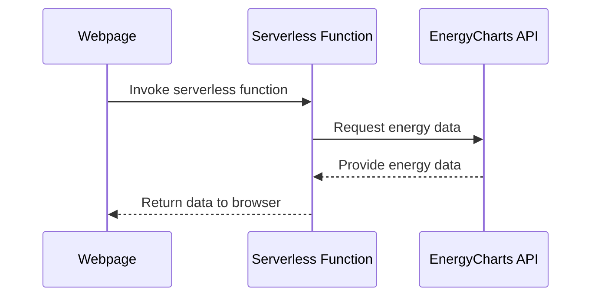

### Electricity Sources Dashboard for Reunion Island

#### Introduction# wind.ishan.fr : A Project to Learn Serverless Functions

Go check it out at wind.ishan.fr !
\## Introduction

The average person's perception of the production factor of wind turbines is extremely exaggerated. I wanted to build a simple indicator in a couple of hours to be able to point to high-quality live data to dispel these beliefs. Mostly this was an excuse to learn about and implement serverless functions.

## Objective

The page displays live wind energy utilization as a percentage of installed capacity. The color-coded background ranges from deep red for low utilization to deep green for high utilization. In fact this is probably overkill, as i've only ever seen it red.

\[\[screenshot_wind_ishan_fr.png\]\]
\## Technologies and Learning Goals

- **HTML, CSS, JavaScript**: The website is extremely simple.
- **Serverless Functions**: The focus was to learn about serverless architecture. When the webpage is loaded, a serverless function is triggered to fetch live data.

## How It Works

On page load, the JS calls a serverless function hosted on netlify, which itself calls the EnergyCharts API to get the necessary data. Then it converts it to a percentage of installed power and displays the absolute value and percentage.



### Deployment

Hosted on Netlify. Configuration is in `netlify.toml`.

## Project Structure

```plaintext
.
├── app.js               # Main JS for data fetch and display
├── index.html           # Main HTML
├── netlify              # Netlify configurations
│   └── functions
│       └── fetchEnergyData.js   # Serverless function for data fetch
├── netlify.toml         # Netlify deployment config
├── package.json         # Dependencies and metadata
└── styles.css           # Webpage styles
```

## Acknowledgments

- Energy Charts team for the wind energy data API.
- Netlify for hosting and enabling serverless functions.

## Conclusion

This quick project served two purposes: resolving a debate and offering a hands-on experience with serverless functions. The dashboard effectively visualizes live wind energy utilization data in Europe.

In France, RTE has a website with [electricity generation by source](https://www.rte-france.com/en/eco2mix/power-generation-energy-source), as well as [CO2 emissions overall](https://www.rte-france.com/en/eco2mix/co2-emissions). However DOMs don't have the same display. The data is available through EDF's open data portals - one per DOM, here's the one for [reunion](https://opendata-reunion.edf.fr/explore/?sort=modified). So i built a replica. This was partly an excuse to learn to use streamlit to build dashboards.

#### Technologies Used

1. **Streamlit**: For rapid prototyping and deployment.
2. **Python**: For data processing and real-time updates.
3. **APIs**: For fetching real-time data.

#### Features

- **Real-Time Metrics**: Display of current power output and CO2 emissions.
- **Energy Sources**: Visual breakdown of different energy contributions.
- **Emissions Tracking**: Time-series data of greenhouse gas emissions.
- **Total Production**: Overview of total electricity production over time.
- **Energy Storage**: Capacity and usage data for stored energy.
- **Single Source Visualization**: Deep-dive into the data of individual energy sources.

#### How It Works

###### Data Collection

All of the data comes from the EDF opendata api, specifically the[Production d'électricité par filière en temps réel](https://opendata-reunion.edf.fr/explore/dataset/prod-electricite-temps-reel/information/). There are also some constant values for CO2 emissions per source per kWh.

###### Data Processing

1. **Aggregation**: Data from multiple sources is aggregated to a single data frame.
2. **Normalization**: Data is normalized for consistent visualization.
3. **Time Series Construction**: Time-based indexing is performed for tracking changes over time.

###### Visualization

1. **Pie Charts**: For the 'Measures' tab, to show current energy mix.
2. **Area Plots**: For 'Energy Sources' and 'Total Production', to visualize contributions over time.
3. **Line Graphs**: For 'Emissions' and 'Storage', to track changes in greenhouse gas emissions and storage capacity.

###### Updates

The dashboard updates every 5 minutes, ensuring the information is current.

#### Lessons Learned

1. **API Limitations**: Not all APIs are well-built. Some update at random intervals, like they get dumps of data from time to time instead of every five minutes. You need to align timestamps and over request to not miss anything.
2. **Streamlit's Flexibility**: Learned how to implement custom features to enrich visualizations. I think they're neat.
3. **Data Accuracy**: Ensured the data was accurate and up-to-date, as it serves an educational purpose and could influence policy.

#### Conclusion

I hope this project serves as an insightful resource for understanding real-time dynamics of electricity production and its environmental impact. Streamlit proved to be an interesting tool for this project, allowing rapid development with guardrails for usability, which come at the price of speed and liberty.
I hope this dashboard can be usefull, I hope to be able to improve it over time. Do not hesitate to provide critique !
