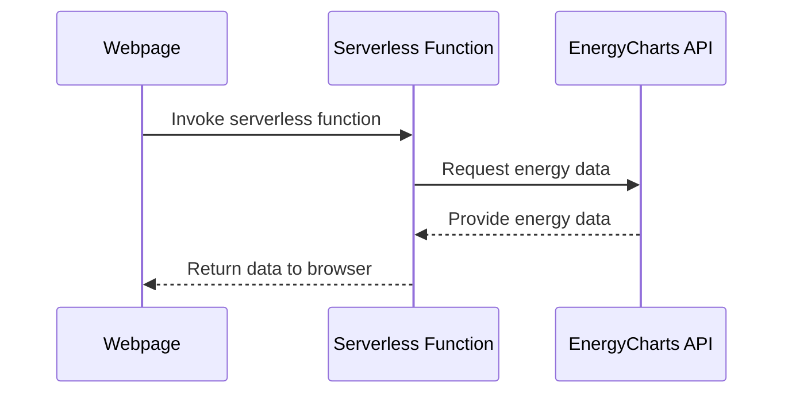

# wind.ishan.fr : A Project to Learn Serverless Functions

Go check it out at wind.ishan.fr !
\## Introduction

The average person's perception of the production factor of wind turbines is extremely exaggerated. I wanted to build a simple indicator in a couple of hours to be able to point to high-quality live data to dispel these beliefs. Mostly this was an excuse to learn about and implement serverless functions.

## Objective

The page displays live wind energy utilization as a percentage of installed capacity. The color-coded background ranges from deep red for low utilization to deep green for high utilization. In fact this is probably overkill, as i've only ever seen it red.

\[\[screenshot_wind_ishan_fr.png\]\]
\## Technologies and Learning Goals

- **HTML, CSS, JavaScript**: The website is extremely simple.
- **Serverless Functions**: The focus was to learn about serverless architecture. When the webpage is loaded, a serverless function is triggered to fetch live data.

## How It Works

On page load, the JS calls a serverless function hosted on netlify, which itself calls the EnergyCharts API to get the necessary data. Then it converts it to a percentage of installed power and displays the absolute value and percentage.



### Deployment

Hosted on Netlify. Configuration is in `netlify.toml`.

## Project Structure

```plaintext
.
├── app.js               # Main JS for data fetch and display
├── index.html           # Main HTML
├── netlify              # Netlify configurations
│   └── functions
│       └── fetchEnergyData.js   # Serverless function for data fetch
├── netlify.toml         # Netlify deployment config
├── package.json         # Dependencies and metadata
└── styles.css           # Webpage styles
```

## Acknowledgments

- Energy Charts team for the wind energy data API.
- Netlify for hosting and enabling serverless functions.

## Conclusion

This quick project served two purposes: resolving a debate and offering a hands-on experience with serverless functions. The dashboard effectively visualizes live wind energy utilization data in Europe.
